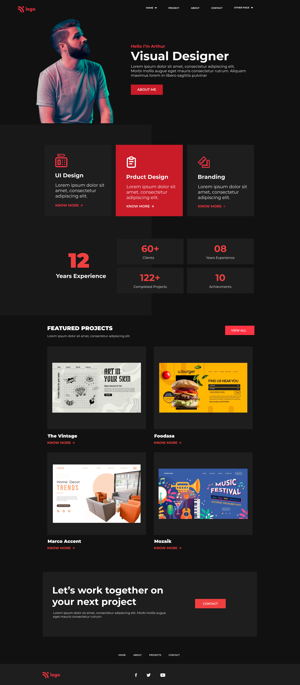

# 🚀 HTML & CSS Project 15🚀

## _Personal Portfolio_ :

This one is a Personal Portfolio design which is created using HTML & CSS. This website is currently responsive.
        

# [ineuron.ai](https://ineuron.ai/)  : Learn from the best of industry

###### _Highest in quality, affordable in price_

## 🔗PROJECT-15 : _Screenshot_

## 🔗__This is fifteenth Project of Html & CSS with mobile responsive_

A HTML, CSS Project. Made with ♥ by Satyam Jaysawal. There will be a Personal Portfolio. In this project we gonna learn how we can create a website using  HTML, CSS. The main purpose of the project is to get more used to with HTML, CSS. Later on, in this project, we gonna learn how we can deploy this site using Netlify. Also, we gonna learn the process from the zero to end and make the website ready for live production.

## 🛠 What we are going to learn

- HTML, CSS
- CSS @Media Queries
- Netlify Deployment
- More . . .

## 🔗 Time took to finish the project

It took me 4 hour to finish this project and it was fun working on it.

## 🔗 Tools Used

1. icons - (flat & Feather icons)
2. illustration - [https://codesandbox.io/u/hiteshchoudhary](https://codesandbox.io/u/hiteshchoudhary)
3. Code Editor: VS Code

## 🔗 FAQ

### How can i get started?

You can get started by following the ineuron Website and learn code online.

### What i need to start the project?

Just open your favorite code editor and follow along with the---

🔗[ Codesandbox /Hitesh choudhary](https://codesandbox.io/u/hiteshchoudhary)..

### Who the project is for?

The project is for the people who wanna get more skilled in HTML & CSS.
Source code is available on my Git hub link

🔗[Source code](https://github.com/satyamjaysawal)(https://github.com/satyamjaysawal/HTML-CSS-PROJECT-15)

## 🚀 Deployed Link : _Netlify_

(https://html-css-p15.netlify.app/)

## Feedback

If you have any feedback, please reach out to us at ....

🔘[Twitter id ](https://twitter.com/s_jaysawal?t=zbTR9vw_U8lRNNDXL1rW4A&s=08)

🔘[linkedin profile](https://www.linkedin.com/in/satyam-jaysawal-9b58b7238)

## 🚀 About Me

I'm a Satyam Jaysawal and i am aspiring to be a Full Stack Web Developer.

📧[sjrecm9258@gmail.com](sjrecm9258@gmail.com)
